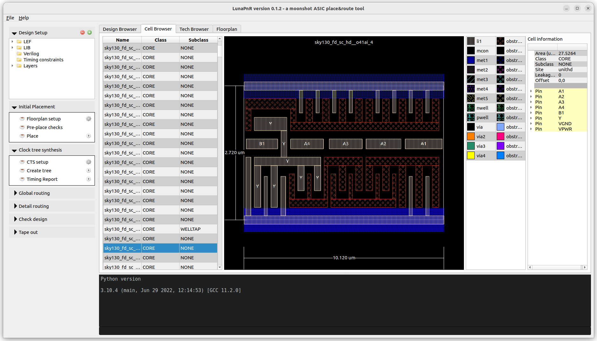
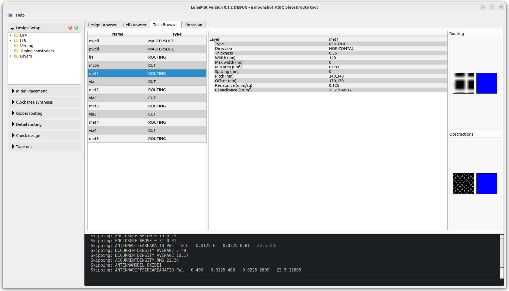
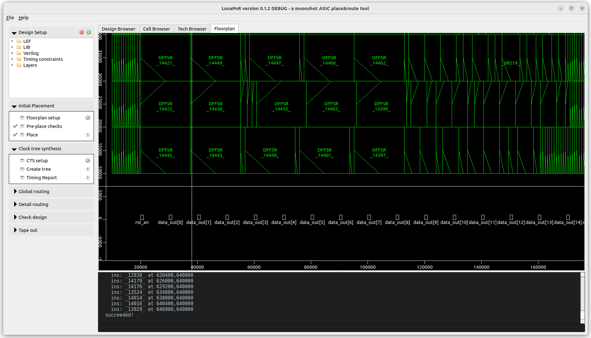

<!--
SPDX-FileCopyrightText: 2021-2022 Niels Moseley, <asicsforthemasses@gmail.com>
SPDX-License-Identifier: GPL-3.0-only
-->
# Luna Place and Route

| Platform | Status |
| -------- | ------ |
| Ubuntu 22.04 LTS |  |
| Windows |  |

For more information, please visit the [homepage](https://www.asicsforthemasses.com "Luna PnR homepage").

<figure></figure>
<figure></figure>
<figure></figure>

## Current development status
* TLDR; Don't expect anything.
* Cell browser works.
* Tech browser works.
* Has layer rendering customization.
* Reads [flat Verilog netlists](https://github.com/asicsforthemasses/LunaPnR/tree/main/test/files/verilog) (no busses - expand them, YMMV).
* Uses/requires external OpenSTA to perform static timing analysis.
* Has a global router based on directed/depth-first search.
* Has an integrated Python 3 based console.

LunaPnR can read the [SKY130](https://github.com/asicsforthemasses/sky130_testing), OSU 180nm, Nangate/FreePDK 45nm cell libraries.

## Build requirements
* GCC (tested with version 11.3)
* CMake 3.20 or higher
* Ninja-build
* Qt 5.12 or higher (qttools5-dev-tools, qtbase5-dev)
* Eigen3 (libeigen3-dev)
* Python 3.8 or higher
* wget
* tar
* libboost-test-dev (for running tests)
* libboost-filesystem-dev (for running tests)
* cppcheck 2.4.1 or higher (optional)
* clang-tidy (optional)

## Building on Linux
* execute './bootstrap.sh', this will generate a ./build directory.
* enter the build directory and type 'ninja'.
* LunaPnR application will be available in ./gui/lunapnr

Supported distributions are:
* Ubuntu 22.04 LTS.

## Building on Windows
* open the Developer Command Prompt for VS 2022.
* make sure to set the BOOST_ROOT environment variable to the location of the BOOST libraries.
* run bootstrap_release.bat in the top level project dir.
* enter the build directory and type 'ninja'.
* LunaPnR application will be available in ./gui/lunapnr

  
## Sponsors
This project is supported by [NLnet](https://nlnet.nl/).

