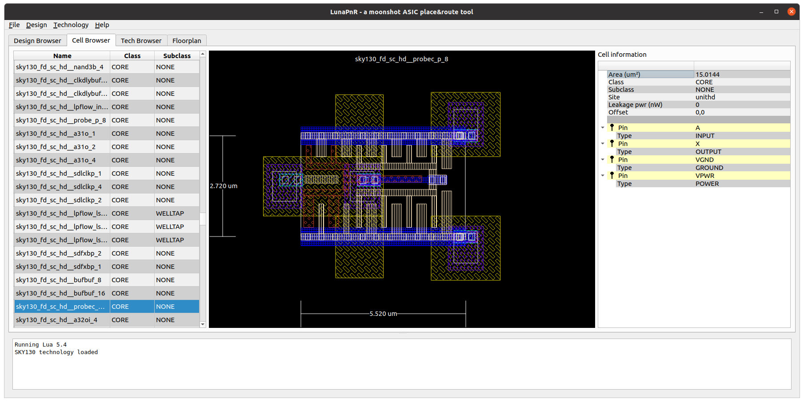

# Luna Place and Route

For more information, please visit the [homepage](https://www.asicsforthemasses.com "Luna PnR homepage").

<figure></figure>

## Current development status
* TLDR; Don't expect anything.
* Cell browser works.
* Tech browser works.
* Has layer rendering customization.
* Reads [flat Verilog netlists](https://github.com/asicsforthemasses/LunaPnR/tree/main/test/files/verilog) (no busses - expand them, YMMV).

LunaPnR can read the [SKY130](https://github.com/asicsforthemasses/sky130_testing), OSU 180nm, Nangate/FreePDK 45nm cell libraries.

## Build requirements
* GCC 9.3 or higher
* CMake 3.16 or higher
* Ninja-build
* Qt 5.12 or higher
* libboost-test-dev (for running tests)
* libboost-filesystem-dev (for running tests)
* cppcheck 2.4.1 or higher (optional)

## Building on Linux
* execute './bootstrap.sh', this will generate a ./build directory.
* enter the build directory and type 'ninja'.
* LunaPnR application will be available in ./gui/lunapnr

  
## Sponsors
This project is supported by [NLnet](https://nlnet.nl/).

